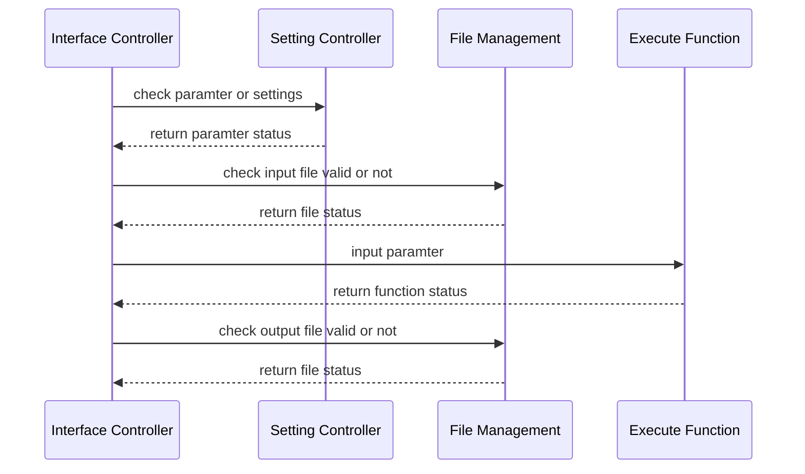

# Requirement Analysis

##  Functional Requirement

### Summary

This project aims to streamline the process of constructing gene regulatory networks using RNA-Seq.

Main steps are as following:

- Preprocess
	- Preprocessing Genotype Data
	- Preprocessing Gene Expression Data
	- Matching Gene Expression Data with Genotype Data
	- Preprocess Genotype Data (Con't)
	- Separating SNPs based on MAF
- Cis-eQTL Analysis
	- Common e-QTL analysis
	- Low-Frequency Cis-eQTL Analysis
	- Rare Cis-eQTL Analysis 
	-  Combined Common, Low-Frequency, and Rare eQTL Results
- Network Analysis
	- Network Analysis
	- Bootstrap Analysis
	- Network Visualization


### Expectation:

1. Put checkpoints at each step to let the users make sure every step is correct.
2. Separate Network Construction Step from Preprocess Steps so as to allow the users to preprocess the data themselves;
3. Provide a function for the preprocess steps of TCGA & GTEx respecctively.

### User Executing Steps

####  1. Prepare Data
- gene expression 
- genotype data 
- annotation (separate for gene and snp)

### 2. Prepare Setting File

- one file is enough
	- preprocess gene
	- genotype
	- network
	
.yml

```par
filepath: ./
genotypename: example.geno
snpname: example.snp
indivname: example.ind
evecoutname: example.pca.evec
evaloutname: example.eval
altnormstyle: NO
numoutevec: 2
numoutlieriter: 5
numoutlierevec: 2
outliersigmathresh: 6.0
qtmode: 0
```
provide default file

#### change settings
```bash
programm -change_settings --parameter value
```
#### lookup settings
```bash
programm -show_settings  --parameter
```

### 3 or 5.  Match genotype and geneexp ?
? not sure before or after
user provide sample ids ?
```bash
tnet geno_geneexp_match 
```

### 4.  Preprocess Genotype Data

```bash
tnet -preprocess_genotype --setting1 v1 --setting2
```

### 5. Preprocess Gene Data

```bash
tnet -preprocess_gene_exp --setting1 v1 --setting2
```
### 6. Control Covariates & Population Structure

```bash
tnet control_cov
```

### 7. Cis-eQTL

```bash
tnet cis-eQTL
- range
- type
- number of cpu
- parallel?
```
estimate wall time

### 8. Network

```
tnet network_analysis
- number of gene
- number of bootstraps 
```

 ```
 tnet summary
```


## Environment Requirement

### Development Environment
 - development language: R/shell
 - development platform: 
 - collaboration: github

# Architecture Design

## Basic Structure

Four main parts: 
- Interface Controller
	- Interpret user input
	- Implement functions in Setting Controller to check validity of input paramters
	- Implement functions in file management to check validity of input and output files
	- Implement execute functions 
- Setting Controller
	- Read setting file
	- Reset parameter
- File Management
	- Check validity of input and output files
	- Clear / reset working directory
	- Show file status
- Execute Function




## Style & Convention

### R programming  convention

Google's R style Guide:
[http://web.stanford.edu/class/cs109l/unrestricted/resources/google-style.html](http://web.stanford.edu/class/cs109l/unrestricted/resources/google-style.html)

## Detailed Design

### Setting Files

Use `.conf` file syntax for user settings

```bash
## 
[Basic]
nchr = 22

[Genotype]
ped.file = PATH/xxx.ped
map.file = PATH/xxx.map

[Gene Expression]
ge.file = PATH/xxx.ge
gpos.file = PATH/xxx.gpos

[PLINK]

[cis-eQTL]
alpha.cis = 0.05


[Network Analysis]
n = 82 #sample size
ngenes = 18402 #number of genes included in the analysis

```
<!--stackedit_data:
eyJoaXN0b3J5IjpbLTIwNDg1OTIwMjEsMzk3MDQzMDA5LC0yMD
k3NDY4OTk3LC0xMDE0MDc2OTE3LDE3NjU0NTMxNTMsLTEzMDc1
NTMxNjksLTYwMTI5NTA4NywxNDkxNTA0NTI2LC02Mjc4NDQ0ND
EsMzE2NzgyNTk1LC0xNzMyNjYwNDg3LDE2NDYwMjA0NiwyNjYy
NTI3OCwzNDc0MjMzNjcsMTMzMTQxODQ4MSwtMTMzOTA3MjU4MS
wtMTY3MDQyNzM1MV19
-->