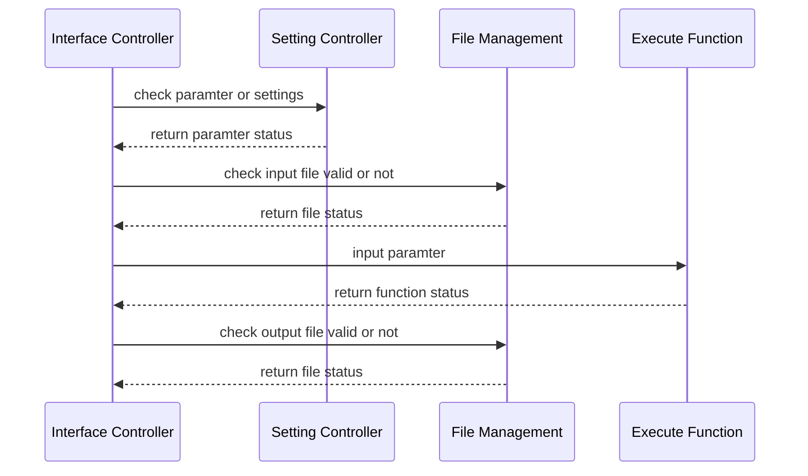

# Requirement Analysis

##  Functional Requirement

### Summary

This project aims to streamline the process of constructing gene regulatory networks using RNA-Seq.

Main steps are as following:

- Preprocess
	- Preprocessing Genotype Data
	- Preprocessing Gene Expression Data
	- Matching Gene Expression Data with Genotype Data
	- Preprocess Genotype Data (Con't)
	- Separating SNPs based on MAF
- Cis-eQTL Analysis
	- Common e-QTL analysis
	- Low-Frequency Cis-eQTL Analysis
	- Rare Cis-eQTL Analysis 
	-  Combined Common, Low-Frequency, and Rare eQTL Results
- Network Analysis
	- Network Analysis
	- Bootstrap Analysis
	- Network Visualization


### Expectation:

1. Put checkpoints at each step to let the users make sure every step is correct.
2. Separate Network Construction Step from Preprocess Steps so as to allow the users to preprocess the data themselves;
3. Provide a function for the preprocess steps of TCGA & GTEx respecctively.

### User Executing Steps

####  1. Prepare Data
- gene expression 
- genotype data 
- annotation (separate for gene and snp)

### 2. Prepare Setting File

- one file is enough
	- preprocess gene
	- genotype
	- network
	
.yml

```par
filepath: ./
genotypename: example.geno
snpname: example.snp
indivname: example.ind
evecoutname: example.pca.evec
evaloutname: example.eval
altnormstyle: NO
numoutevec: 2
numoutlieriter: 5
numoutlierevec: 2
outliersigmathresh: 6.0
qtmode: 0
```
provide default file

#### change settings
```bash
programm -change_settings --parameter value
```
#### lookup settings
```bash
programm -show_settings  --parameter
```

### 3 or 5.  Match genotype and geneexp ?
? not sure before or after
user provide sample ids ?
```bash
tnet geno_geneexp_match 
```

### 4.  Preprocess Genotype Data

```bash
tnet -preprocess_genotype --setting1 v1 --setting2
```

### 5. Preprocess Gene Data

```bash
tnet -preprocess_gene_exp --setting1 v1 --setting2
```
### 6. Control Covariates & Population Structure

```bash
tnet control_cov
```

### 7. Cis-eQTL

```bash
tnet cis-eQTL
- range
- type
- number of cpu
- parallel?
```
estimate wall time

### 8. Network

```
tnet network_analysis
- number of gene
- number of bootstraps 
```

 ```
 tnet summary
```


## Environment Requirement

### Development Environment
 - development language: R/shell
 - development platform: 
 - collaboration: github

# Architecture Design

## Basic Structure

Four main parts: 
- Interface Controller
	- Interpret user input
	- Implement functions in Setting Controller to check validity of input paramters
	- Implement functions in file management to check validity of input and output files
	- Implement execute functions 
- Setting Controller
	- Read setting file
	- Reset parameter
- File Management
	- Check validity of input and output files
	- Clear / reset working directory
	- Show file status
- Execute Function




## Style & Convention


R style Guide:
[https://style.tidyverse.org/index.html](https://style.tidyverse.org/index.html)

Shell Style Guide
[https://google.github.io/styleguide/shellguide.html](https://google.github.io/styleguide/shellguide.html)

## Detailed Design

### Setting File

Use `.conf` file syntax for user settings

```bash
# basic settings
[Basic]
nchr = 22
storage.path = STORAGE_PATH

[Genotype]
ped.file = PATH/xxx.ped
map.file = PATH/xxx.map

[Gene Expression]
ge.file = PATH/xxx.ge
gpos.file = PATH/xxx.gpos

[PLINK]
mind = 0.1
ggeno = 0.1
hwe = 0.0001
recode = A

[cis-eQTL]
alpha.cis = 0.05
uncor.ncis = 3
uncor.r = 0.5
nperms = 100
upstream = 1000
downstream = 500

[Network Analysis]
nboots = 100
nnodes = 500
ncores = 16
memory = 64
walltime = 4
```

### Setting Controller

``` r
#` reset All settings
resetSettings -> function (){
}
#` get Parameter from setting file
#` @return list object contains params and values
getParameter -> function(setting_file_path, paramter){
}
#` set single parameter
#` @return 
setParameter -> function (section, parameter,value)
#` check validity of parameter
#` @return  status=TRUE or FALSE, error_msg=''
checkParameter -> function (paramter, value)
```

### File Management

```r
# check validity of file
checkFile -> function(type, path)
# delete all working files
clearWorkDirectory -> function()
# clear certain type file
clearFile -> function(type)
# get file summary
getFileSummary -> function()
```

### Execute Functions
#### Preprocess Genotype Data
```r
getBEDfromBCF -> function(bcf_file_path, bed_file_path{}

makeFAMfile -> function(sample_path, gdc_path,lusc_path,
fam_file_path,sort_file_path){}

filterMissingValue -> function(genotype_file_path, 
out_file_path, geno=0.1, 
hwe=0.001, web_check=FALSE, 
recode=TRUE){}

removeSamples -> function(genotype_file, 
output_file, 
mind=0.1,web=FALSE, recode=TRUE){}

splitGenotypeByChromosome -> function(genotype_file){
}


```

```r
# Get three types of output files
preprocessGenotype -> function(ped_file,
map_file, PLINK_settings){
}
# compute minor allele frequency for each SNP
computeMAF ->function(matched_geno_file,clean_gonotype_file){}
# seperate SNP based on MAF
seperateSNP -> function(map_file,maf_file,geno_file){}
```
#### Preprocess Gene Expression Data
```r
# check whether the data has been normalized
checkNormalization-> function(){}
# impute missing values if there are any
imputeMissingValues -> function(){}
# pc analysis
pcAnalysis -> function(){}
preprocessGeneExpression -> function(ge_file, gpos_file){
}
```

#### Matching Gene Expression Data with Genotype Data

```r
matchGenotypeAndGeneExp -> function(gexp_file, 
gene_pos_file, 
geno_file, 
clean_genotype_file){}
```
#### Cis-eQTL

```r
ciseQTL -> function(matched_file, 
gene_anotation_file,
genopos_file,
maf_type,
p_values,
nnodes,n_cores,wall_time){}
# Selecting Uncorrelated Cis-eQTL of each gene
selectUncorrelatedCiseQTL -> function(){}
```

#### Network Analysis

``` r
# organize gene expression and genotype data
organizeData -> function(gene_exp_file,geno_file,uncoryx_file){}
# get information of genes in network data
getNetworkGeneInfo-> function(){}
# construct gene regulatory network
tspls -> function(){}
bootstrapAnalysis -> function(adj_matrix_file,
coef_matrix_file,nboots,nnodes,n_cores,wall_time){}
```

<!--stackedit_data:
eyJoaXN0b3J5IjpbMTM3OTM2NjA5MywtMTg0ODI3NTg0NSwxMT
MyMjA4MiwtOTIzMDY0MTQyLDY2MjU2NjU2LDYyNTU1NjAwMiwt
MTczMjc4OTM3MCwzOTcwNDMwMDksLTIwOTc0Njg5OTcsLTEwMT
QwNzY5MTcsMTc2NTQ1MzE1MywtMTMwNzU1MzE2OSwtNjAxMjk1
MDg3LDE0OTE1MDQ1MjYsLTYyNzg0NDQ0MSwzMTY3ODI1OTUsLT
E3MzI2NjA0ODcsMTY0NjAyMDQ2LDI2NjI1Mjc4LDM0NzQyMzM2
N119
-->