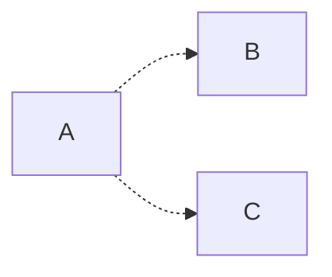
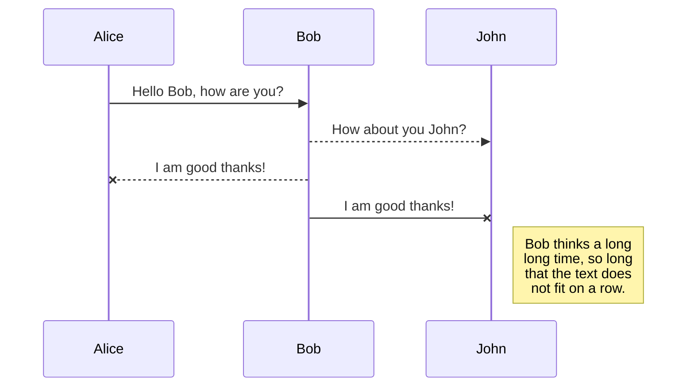

# Requirement Analysis

##  Functional Requirement

### Summary

This project aims to streamline the process of constructing gene regulatory networks using RNA-Seq.

Main steps are as following:

- Preprocessing Genotype Data
- Preprocessing Gene Expression Data
- Matching Gene Expression Data with Genotype Data
- Preprocess Genotype Data (Con't)
- Separating SNPs based on MAF
- Cis-eQTL Analysis
- Network Analysis



### Function 1

#### Input 
- format:
- example
	```r
		### 
		### 
		```
	
#### Process

Breif introduction to the algorithm

#### Output
- format:
- example
	```r
		### 
		### 
		```

### Function 2

## Environment Requirement

### Development Environment
 - development language: R/shell
 - development platform: 
 - collaboration: github
 - Test:

# Architecture Design

## Structure Design

### File structure
- directory 1
	- directory 2
	- 
### Class & Function Structure


## Workflow Design




## Style & Convention

### R programming  convention

Google's R style Guide:
[http://web.stanford.edu/class/cs109l/unrestricted/resources/google-style.html](http://web.stanford.edu/class/cs109l/unrestricted/resources/google-style.html)
<!--stackedit_data:
eyJoaXN0b3J5IjpbLTE3MzI2NjA0ODcsMTY0NjAyMDQ2LDI2Nj
I1Mjc4LDM0NzQyMzM2NywxMzMxNDE4NDgxLC0xMzM5MDcyNTgx
LC0xNjcwNDI3MzUxXX0=
-->