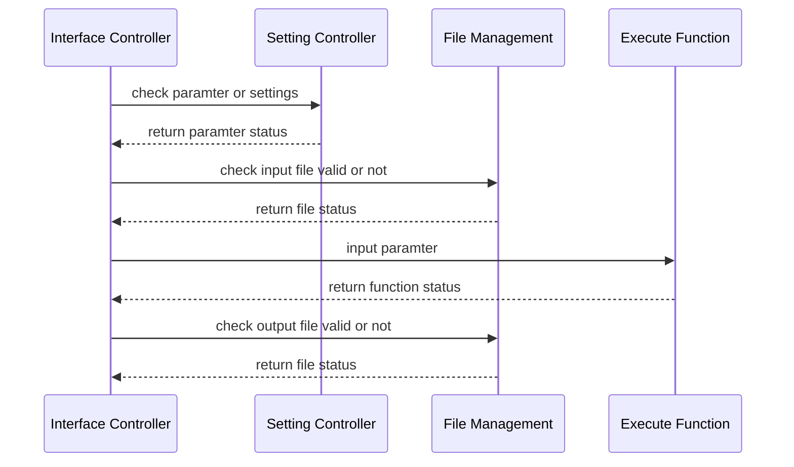

# Requirement Analysis

##  Functional Requirement

### Summary

This project aims to streamline the process of constructing gene regulatory networks using RNA-Seq.

Main steps are as following:

- Preprocess
	- Preprocessing Genotype Data
	- Preprocessing Gene Expression Data
	- Matching Gene Expression Data with Genotype Data
	- Preprocess Genotype Data (Con't)
	- Separating SNPs based on MAF
- Cis-eQTL Analysis
	- Common e-QTL analysis
	- Low-Frequency Cis-eQTL Analysis
	- Rare Cis-eQTL Analysis 
	-  Combined Common, Low-Frequency, and Rare eQTL Results
- Network Analysis
	- Network Analysis
	- Bootstrap Analysis
	- Network Visualization


### Expectation:

1. Put checkpoints at each step to let the users make sure every step is correct.
2. Separate Network Construction Step from Preprocess Steps so as to allow the users to preprocess the data themselves;
3. Provide a function for the preprocess steps of TCGA & GTEx respecctively.

### User Executing Steps

####  1. Prepare Data
- gene expression 
- genotype data 
- annotation (separate for gene and snp)

### 2. Prepare Setting File

- one file is enough
	- preprocess gene
	- genotype
	- network
	
.yml

```par
filepath: ./
genotypename: example.geno
snpname: example.snp
indivname: example.ind
evecoutname: example.pca.evec
evaloutname: example.eval
altnormstyle: NO
numoutevec: 2
numoutlieriter: 5
numoutlierevec: 2
outliersigmathresh: 6.0
qtmode: 0
```
provide default file

#### change settings
```bash
programm -change_settings --parameter value
```
#### lookup settings
```bash
programm -show_settings  --parameter
```

### 3 or 5.  Match genotype and geneexp ?
? not sure before or after
user provide sample ids ?
```bash
tnet geno_geneexp_match 
```

### 4.  Preprocess Genotype Data

```bash
tnet -preprocess_genotype --setting1 v1 --setting2
```

### 5. Preprocess Gene Data

```bash
tnet -preprocess_gene_exp --setting1 v1 --setting2
```
### 6. Control Covariates & Population Structure

```bash
tnet control_cov
```

### 7. Cis-eQTL

```bash
tnet cis-eQTL
- range
- type
- number of cpu
- parallel?
```
estimate wall time

### 8. Network

```
tnet network_analysis
- number of gene
- number of bootstraps 
```

 ```
 tnet summary
```


## Environment Requirement

### Development Environment
 - development language: R/shell
 - development platform: 
 - collaboration: github

# Architecture Design

## Basic Structure

Four main parts: 
- Interface Controller
	- Interpret user input
	- Implement functions in Setting Controller to check validity of input paramters
	- Implement functions in file management to check validity of input and output files
	- Implement execute functions 
- Setting Controller
	- Read setting file
	- Reset parameter
- File Management
	- Check validity of input and output files
	- Clear / reset working directory
	- Show file status
- Downloader
	- Download files
- Execute Function
- System Test
	- Memory / storage test
	- time estimate
- Parallel Compute Helper
	- Common functions for parallel computing





## Style & Convention


R style Guide:
[https://style.tidyverse.org/index.html](https://style.tidyverse.org/index.html)

Shell Style Guide
[https://google.github.io/styleguide/shellguide.html](https://google.github.io/styleguide/shellguide.html)

### Reference Project

ggplot 2
[https://github.com/tidyverse/ggplot2](https://github.com/tidyverse/ggplot2)

multiDimBio
[https://github.com/scarpino/multiDimBio](https://github.com/scarpino/multiDimBio)

bQTL
[https://github.com/erdavenport/bQTL](https://github.com/erdavenport/bQTL)

**Phangorn** 
[https://github.com/KlausVigo/phangorn](https://github.com/KlausVigo/phangorn)

### Some Principles to Rewrite the Code

1. Split code into different functions and files
2. Keep the function as simple as possible, especially split the data process / computing / plot / summary
3. Don't write similar code for more than 2 times, if so extract the common part into a seperate function
4. Single function no more than 100 lines, single file no more than 300 lines (at best). 
5. To make the code flexible, avoid directly writing specific file path or file name into functions, read path or file names by loading settings (if neccesary ) or defining constant (not so flexible, can be used for storing temporary data).
6. For collaboration work, define the input and output format in detail of each block for others to reference. Within the block, input/output can be more flexible.
7. Write comments for each file and each function according to the style guide

## Data and File Design
### File Design

```r
## data files
data/
- genotype/
	- data/
	- result/
- gexp/
	- data/
	- result/
- cis_eqtl/
	- data/
	- result/
- network/
	- data/
	- result/


## setting files
settings/
- config.conf

# code files
# `task_name/` folder contain the specific code for a specific task, like `TCGA/` or `GTEx`
scripts/
- setting_control.R
- system_test.R
- downloader.R
- file_management.R
- pallel_compute_helper.R
- preprocess/
	- task_name/
		- xxx_preprocess.r
	- gexp_preprocess.r
	- genotype_preprocess.r
	- match_preprocess.r
- cis_eqtl_analysis/
	- cis_eqtl.r
- network_analysis/
	- network_anlaysis.r
- main.r


```

### Data summary

| Index | Path | Name| Format|
|--|--| --|--|
| 1 | data/genotype/ | clean_genotype.ped|.ped|
| 2 | data/genotype/ |  ||
| 3 |  | ||

### Data Flow

| Step | Input | Output |
|--|--| --|
| Genotype Preprocess | 1,2 | 3|

### Data Format

#### .ped File
#### .map File
####  .maf File
#### .ge File
#### .gpos File
 


## Detailed Design


### Setting File

Use `.conf` file syntax for user settings

```bash
# basic settings
[Basic]
nchr = 22
storage.path = STORAGE_PATH

[Genotype]
ped.file = PATH/xxx.ped
map.file = PATH/xxx.map


[Gene Expression]
ge.file = PATH/xxx.ge
gpos.file = PATH/xxx.gpos

[PLINK]
mind = 0.1
ggeno = 0.1
hwe = 0.0001
recode = A

[cis-eQTL]
alpha.cis = 0.05
uncor.ncis = 3
uncor.r = 0.5
nperms = 100
upstream = 1000
downstream = 500

[Network Analysis]
nboots = 100
nnodes = 500
ncores = 16
memory = 64
walltime = 4
```

### Setting Controller

``` r
#` reset All settings
resetSettings -> function (){
}
#` get Parameter from setting file
#` @return list object contains params and values
getParameter -> function(setting_file_path, paramter){
}
#` set single parameter
#` @return 
setParameter -> function (section, parameter,value)
#` check validity of parameter
#` @return  status=TRUE or FALSE, error_msg=''
checkParameter -> function (paramter, value)
```

### File Management

```r
# check validity of file
checkFile -> function(type, path)
# delete all working files
clearWorkDirectory -> function()
# clear certain type file
clearFile -> function(type)
# get file summary
getFileSummary -> function(){}
```

### SystemTest
```r
memoryTest -> function(){}
```

### ParallelComputeHelper
```r
##` if we can extract some common functions for distributed computing
```

### DataDownloader

Data downloader 

```r

downloadHelper ->
function()

get1000GenomeData ->
function(download_path,to_path){}

getGenomicMap -> 
function(download_path,to_path){}

getImpute2 -> 
function(download_path,to_path){}

getGeneExpressionData -> 
function(lusc_path,luad_path,raw_count_path){}

```

### Execute Functions

#### Preprocess Genotype Data (TCGA)

Calling germline variants
```r
matchLUADSample ->
function(){}
```

Plink Process
```r
getBEDfromBCF -> 
function(bcf_file_path, bed_file_path){}

makeFAMfile -> 
function(sample_path, gdc_path,lusc_path,
fam_file_path,sort_file_path){}

filterMissingValue -> 
function(genotype_file_path, 
out_file_path, geno=0.1, 
hwe=0.001, web_check=FALSE, 
recode=TRUE){}

removeSamples -> 
function(genotype_file, 
output_file, 
mind=0.1,web=FALSE, recode=TRUE){}

splitGenotypeByChr -> 
function(genotype_file){}
```
```r
## Set constant
path_1 = ...
plinkProcess -> function(?)
{
	getBEDfromBCF()
	makeFAMfile()
	filterMissingValue()
	removeSamples()
	splitGenotypeByChr()
}
```

Imputation

```r
convertCoordinatesForTCGA -> 
function(){}?

removeFamilyInfo -> 
function(ped_file, out_file){}

createPedByChr -> 
function(ped_file, chromo_num){}

convertMapIntoImpute ->
function(input_file, output_file)

convertStudyGenomeIntoImpute ->
function(genotype_file_path, out_path){}

convertGenomicMapToShapeIt ->
function(input_file,output_file){}

genotypePreprocess -> 
function(){}

mergeChunks -> function(input_file,output_file){}

testImputationRuntime ->
function(){}

setImputeJob ->
function(?, cpu_num){}

combineGenotypeAcrossAllChr->
function(){}

```

```r
# download and process refrence data for imputation for TCGA data
downloadAndProcessReferenceData ->
function(?){
	download1000GenomeData()
	downloadGenomicMap()
	downloadImpute2()
	convertGenomicMapToShapeIt()
}
```

``` r
## Set constant
path_1 = ...

imputationProcess ->
function(?){
	
	convertCoordinatesForTCGA()?
	
	#preprocess study data
	removeFamilyInfo()
	splitPedByChr()
	convertStudyGenomeIntoImpute()
	
	# download and process reference data
	downloadAndProcessReferenceData()
	
	#impute
	testImputationRuntime()
	setImputeJob()
	
	# merge files
	mergeChunks()
	combineGenotypeAcrossAllChr()
}
```

combine process

```r
# main function for preprocessing TCGA
genotypePreprocess -> 
function(?){
	pinkProcess()
	imputationProcess()
}
```

FromTsplsVersion
```r
# Get three types of output files
preprocessGenotype -> function(ped_file,
map_file, PLINK_settings){
}
# compute minor allele frequency for each SNP
computeMAF ->function(matched_geno_file,clean_gonotype_file){}
# seperate SNP based on MAF
seperateSNP -> function(map_file,maf_file,geno_file){}
```


#### Preprocess Gene Expression Data (TCGA)

```r

varianceStabTransformation ->
function(mcounts,thresh,out_gexp_id,out_gexp,out_gene_pos){}

preprocessGeneExpression ->
function(?){
	downloadGeneExpressionData()
	varianceStabTransformation()
}

```
#### Maching Gene Expression with Genotype

```r
extractGenotypeData ->
function(geno_idx,geno,matched_geno){}

matchGeneExpressionAndGenotype ->
function(geno_id,gexp_id,out_geno,out_gene_exp){
	...
	extractGenotypeData(geno_idx,geno,out_geno)
}
```

#### Preprocess Genotype(cont.)

```r
# split SNP by chromosome
splitSNPByChr->
function(matched_geno, geno_size, chr_count,out_path){}

# compute minor allele frequency for each SNP
computeMAF ->
function(input_file){}

filterSNPByMAF ->
function(geno_file,out_file,thresh){}

summarizeMAFforSNP ->
function()

seperateSNPByMAF ->
function(geno_data,out_file,
out_pos_file,type){}

```

#### PCA Stratification 
```r
setupData ->
function(geno_file,map_file,
fam_file,geno_id_file,
out_geno_eigenstrat,out_snp,out_geno_id){}

genoPCA ->
function(geno_files,out_pca_files)

adjustGeneExpression ->
function(pca_file,geno_id_file,gexp_file,out_gexp_file,out_geno_file){}

```

#### Cis eQTL

```r

findCisPairIndex -> 
function(gene_file,gexp_file,cis_type){}

cisSummary ->
function(gexp_data){}


cisAnalysis ->
function(cis_type, n_gene, n_jobs...?){}

calcPValue -> 
function(cis_type){}

selectSignificant -> 
function(cis_type,p_value)

combineEQTLResult ->
function(common, low, rare){}

selectSignificantForAll ->
function(pvalue)

summaryEQTResult ->
function()
```

#### Network Analysis

```r
setUpDataForNetwork ->
function(gexp_data,eqtl_data,sig_data){}

getUncorrelatedSNPByGene ->
function(){}

checkGeneTypeOfEQTL ->
function(){}

getNetworkData ->
function()

```
#### Boostrap Analysis
```r
genBootData ->
function(nb,gene_data,
cis_eqtl_data,net_idx){}

ridgeRegression ->
function(y, ncx){}

boot_stage1 ->
function(adj_matrix_file,
coef_matrix_file,nboots,nnodes,
n_cores,wall_time{}

boot_stage2 ->
function(adj_matrix_file,
coef_matrix_file,nboots,
nnodes,
n_cores,wall_time){}

```

#### Network Visualization
```r
genEdgeFreq ->
function(adjMat){}

prepareVisualizationData ->
function(){}

genSubNetwork ->
function(netData,subIndex){}

visualizeNetwork ->
function(netData){}


```


#### Matching Gene Expression Data with Genotype Data

```r
matchGenotypeAndGeneExp -> 
function(gexp_file, 
gene_pos_file, 
geno_file, 
clean_genotype_file){}
```
#### Cis-eQTL

```r
ciseQTL -> function(matched_file, 
gene_anotation_file,
genopos_file,
maf_type,
p_values,
nnodes,n_cores,wall_time){}
# Selecting Uncorrelated Cis-eQTL of each gene
selectUncorrelatedCiseQTL -> function(){}
```

#### Network Analysis

``` r
# organize gene expression and genotype data
organizeData -> function(gene_exp_file,geno_file,uncoryx_file){}
# get information of genes in network data
getNetworkGeneInfo-> function(){}
# construct gene regulatory network
tspls -> function(){}
bootstrapAnalysis -> function(adj_matrix_file,
coef_matrix_file,nboots,nnodes,n_cores,wall_time){}
```

<!--stackedit_data:
eyJoaXN0b3J5IjpbMTgyMjY3MDY3Miw3Mjc0MDAxNjIsLTE0OD
cyNjYzMjMsLTM4NTc1MDUyOSwtMjEyMzMyMDQzNCwtNDY2NDIz
NjY0LC0xNTQxMzM2OTM2LC02NTI1NTcwMCwtOTc3MzAxMzI2LC
0yMjU0NjU4OTAsLTYyNjQ0NjI2NiwtMTM2MDAxODA2MSwtMTk1
ODIxNzUxMCwtOTY0NTQ3ODQ4LC0xODE0NTIzNzcyLC0xODk5OD
IzNjA1LC0yMDg3MjcwNDAyLDE1ODcwNTI3MzYsMTE2MTYwMjc3
NiwtMTM0NTcwMDM4N119
-->