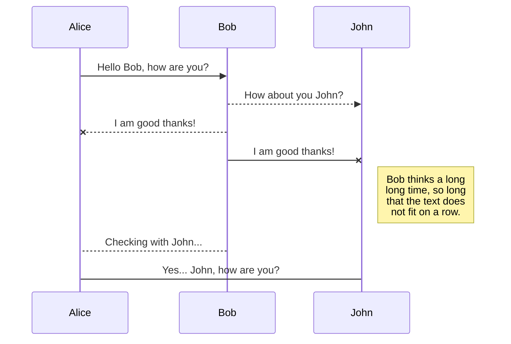

# Requirement Analysis

##  Functional Requirement

### Summary

This project will contain following functions:
- function 1
- function 2
- function 3
- etc...


### Function 1

#### Input 
- format:
- example
	```r
		### 
		### 
		```
	
#### Process

Breif introduction to the algorithm

#### Output
- format:
- example
	```r
		### 
		### 
		```

### Function 2

## Environment Requirement

### Development Environment
 - development language: R/shell
 - development platform: 
 - collaboration: github
 - Test:

# Architecture Design

## Structure Design

### File structure
- directory 1
	- directory 2
	- 
### Class & Function Structure

```mermaid
classDiagram

```

## Workflow Design



## Style & Convention

### R programming  convention

Google's R style Guide:
[http://web.stanford.edu/class/cs109l/unrestricted/resources/google-style.html](http://web.stanford.edu/class/cs109l/unrestricted/resources/google-style.html)
<!--stackedit_data:
eyJoaXN0b3J5IjpbNzAxNTY4MTEwLDI2NjI1Mjc4LDM0NzQyMz
M2NywxMzMxNDE4NDgxLC0xMzM5MDcyNTgxLC0xNjcwNDI3MzUx
XX0=
-->