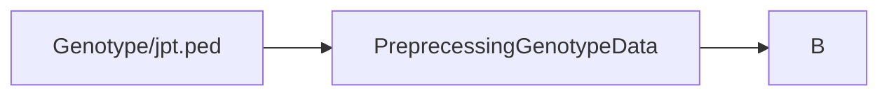

# Requirement Analysis

##  Functional Requirement

### Expectation:

1. Put checkpoints at each step to let the users make sure every step is correct.
2. Separate Network Construction Step from Preprocess Steps so as to allow the users to preprocess the data themselves;
3. Provide a function for the preprocess steps of TCGA & GTEx respecctively.

### User Input and Output

####  1. Prepare Data
- gene expression 
- genotype data 
- annotation (separate for gene and snp)

### 2. Prepare Setting File

- one file is enough
	- preprocess gene
	- genotype
	- netowork
	
.yml

```par
genotypename: example.geno
snpname: example.snp
indivname: example.ind
evecoutname: example.pca.evec
evaloutname: example.eval

altnormstyle: NO

numoutevec: 2

numoutlieriter: 5

numoutlierevec: 2

outliersigmathresh: 6.0

qtmode: 0
```

### 3. Set the Setting file

```bash
programm -setting **.config
```


 

### Summary

This project aims to streamline the process of constructing gene regulatory networks using RNA-Seq.

Main steps are as following:

- Preprocess
	- Preprocessing Genotype Data
	- Preprocessing Gene Expression Data
	- Matching Gene Expression Data with Genotype Data
	- Preprocess Genotype Data (Con't)
	- Separating SNPs based on MAF
- Cis-eQTL Analysis
	- Common e-QTL analysis
	- Low-Frequency Cis-eQTL Analysis
	- Rare Cis-eQTL Analysis 
	-  Combined Common, Low-Frequency, and Rare eQTL Results
- Network Analysis
	- Network Analysis
	- Bootstrap Analysis
	- Network Visualization

### Basic Input & Output Diagram
Input & output  process can be summarized as following:
#### Preprocess


### Function 1

#### Input 
- format:
- example
	```r
		### 
		### 
		```
	
#### Process

Breif introduction to the algorithm

#### Output
- format:
- example
	```r
		### 
		### 
		```

### Function 2

## Environment Requirement

### Development Environment
 - development language: R/shell
 - development platform: 
 - collaboration: github
 - Test:

# Architecture Design

## Structure Design

### File structure
- directory 1
	- directory 2
	- 
### Class & Function Structure


## Workflow Design


## Style & Convention

### R programming  convention

Google's R style Guide:
[http://web.stanford.edu/class/cs109l/unrestricted/resources/google-style.html](http://web.stanford.edu/class/cs109l/unrestricted/resources/google-style.html)
<!--stackedit_data:
eyJoaXN0b3J5IjpbLTE3NTQ1Mjk5MjMsLTYyNzg0NDQ0MSwzMT
Y3ODI1OTUsLTE3MzI2NjA0ODcsMTY0NjAyMDQ2LDI2NjI1Mjc4
LDM0NzQyMzM2NywxMzMxNDE4NDgxLC0xMzM5MDcyNTgxLC0xNj
cwNDI3MzUxXX0=
-->